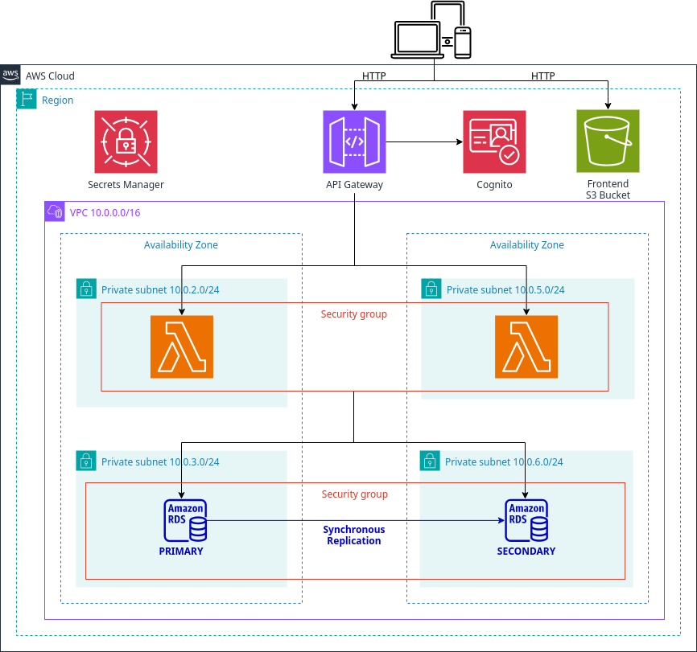

# Grupi - Pool Management System (Terraform + AWS Lambda + API Gateway + RDS + S3 + Cognito)

Este proyecto define y despliega la infraestructura backend completa para la aplicación **Grupi**, un sistema de gestión de pools de compras que permite a usuarios:

✅ Registrarse y autenticarse con Amazon Cognito  
✅ Crear y gestionar productos  
✅ Crear y unirse a pools de compras  
✅ Realizar solicitudes de compra  
✅ Persistir datos en base de datos RDS (PostgreSQL)  
✅ Almacenar archivos estáticos en S3  

---

## Arquitectura



La infraestructura se define completamente en **Terraform** y utiliza:

- **VPC** con subredes públicas y privadas
- **RDS (PostgreSQL)** para almacenar datos de productos, pools y solicitudes
- **S3** para hosting de sitio web estático
- **Cognito** para autenticación y gestión de usuarios
- **API Gateway** para exponer las Lambdas vía HTTP
- **Lambda Functions** para lógica del backend
- **RDS Proxy** para conexiones optimizadas a la base de datos

---

## Estructura del proyecto

```
├── api_gateway.tf            # Configuración de API Gateway
├── cognito.tf                # Configuración de Amazon Cognito
├── datasources.tf            # Data sources de Terraform
├── lambdas.tf                # Configuración de Lambda Functions
├── locals.tf                 # Variables locales
├── outputs.tf                # Outputs de Terraform
├── provider.tf               # Configuración del provider AWS
├── rds.tf                    # Configuración de RDS (PostgreSQL)
├── rds_proxy.tf              # Configuración de RDS Proxy
├── s3.tf                     # Configuración de buckets S3
├── security_groups.tf        # Security Groups
├── vpc.tf                    # Configuración de VPC
├── variables.tf              # Definición de variables
├── versions.tf               # Versiones de providers
├── terraform.tfvars          # Variables de configuración
├── functions/                # Lambda Functions
│   ├── lambda_get_pools.py           # Obtener lista de pools
│   ├── lambda_get_pool_details.py    # Obtener detalles de pool
│   ├── lambda_get_pool_requests.py   # Obtener solicitudes de pool
│   ├── lambda_get_products.py        # Obtener lista de productos
│   ├── lambda_get_product_details.py # Obtener detalles de producto
│   ├── lambda_post_pools.py          # Crear nuevo pool
│   ├── lambda_post_pool_requests.py  # Crear solicitud de pool
│   ├── lambda_post_products.py       # Crear nuevo producto
│   ├── lambda_rds_init.py            # Inicializar base de datos
│   └── *.zip                         # Archivos ZIP de las funciones
├── layers/                   # Capas Lambda
│   ├── layer_psycopg2.zip    # Capa para PostgreSQL (psycopg2)
│   └── python/              # Dependencias Python
├── modules/                  # Módulos de Terraform
│   ├── cloudfront/           # Módulo para CloudFront
│   ├── http_api/             # Módulo para HTTP API
│   ├── lambda/               # Módulo para Lambda
│   └── vpc/                  # Módulo para VPC
├── resources/                # Frontend estático
│   ├── *.html                # Páginas web (index, login, signup, etc.)
│   ├── *.js                  # JavaScript del frontend
│   ├── *.css                 # Estilos CSS
│   ├── package.json          # Dependencias npm
│   └── tailwind.config.js     # Configuración de Tailwind CSS
├── build-layers.sh           # Script para construir capas Lambda
├── compile-css.sh            # Script para compilar CSS
└── zip-lambdas.sh            # Script para empaquetar Lambdas
```

---

## Lambda Functions

**Funciones implementadas:**

- `lambda_get_pools` → Obtener lista de pools disponibles
- `lambda_get_pool_details` → Obtener detalles específicos de un pool
- `lambda_get_pool_requests` → Obtener solicitudes de un pool
- `lambda_get_products` → Obtener lista de productos
- `lambda_get_product_details` → Obtener detalles de un producto
- `lambda_post_pools` → Crear nuevo pool de compras
- `lambda_post_pool_requests` → Unirse a un pool (crear solicitud)
- `lambda_post_products` → Crear nuevo producto
- `lambda_rds_init` → Inicializar esquema de base de datos

---

## Frontend

El sitio web estático se encuentra en `resources/`:

- `index.html` → Página principal
- `login.html`, `signup.html` → Autenticación
- `pools.html` → Gestión de pools
- `products.html` → Gestión de productos
- `requests.html` → Gestión de solicitudes
- `pool-details.html` → Detalles de pool
- `product-details.html` → Detalles de producto

**JavaScript:**
- `auth.js` → Autenticación con Cognito
- `api-client.js` → Cliente para API Gateway
- `auth-guard.js` → Protección de rutas
- `pools.js`, `products.js`, etc. → Lógica específica de cada página

---

## Base de datos

**Esquema implementado:**

- **product**: Productos disponibles
- **pool**: Pools de compras
- **request**: Solicitudes de usuarios a pools

**Relaciones:**
- `pool.product_id` → `product.id`
- `request.pool_id` → `pool.id`

---

## Dependencias necesarias

### Herramientas requeridas:

- **Terraform** (>= 1.0)
- **AWS CLI** (>= 2.0)
- **Node.js** (>= 18) y **npm**
- **Python** (3.11)
- **uv** (Python package manager)
- **zip** (para empaquetar Lambdas)

---

## Configuración inicial

### 1. Configurar credenciales de AWS

```bash
aws configure
```

Ingresa:
- AWS Access Key ID
- AWS Secret Access Key  
- Default region (ej: `us-east-1`)
- Default output format (ej: `json`)

### 2. Configurar variables de Terraform

Edita `terraform.tfvars` con tus valores:

```hcl
db_password = "tu_password_seguro"
```

---

## Comandos para ejecutar

**Nota**: Los archivos ZIP de las Lambdas y el CSS compilado ya están presentes en el repositorio, por lo que no es necesario ejecutar los scripts de construcción. Los scripts están disponibles por si necesitas regenerar estos archivos.

### 1. (Opcional) Construir capas Lambda

```bash
./build-layers.sh
```

### 2. (Opcional) Empaquetar funciones Lambda

```bash
./zip-lambdas.sh
```

### 3. (Opcional) Compilar CSS del frontend

```bash
./compile-css.sh
```

### 4. Inicializar Terraform

```bash
terraform init
```

### 5. Planificar cambios

```bash
terraform plan
```

### 6. Aplicar infraestructura

```bash
terraform apply
```

**⚠️ Importante**: Debido a la presencia del RDS Proxy, es necesario esperar unos minutos después del deploy para que el proxy termine de inicializarse completamente antes de poder hacer solicitudes a la API. El RDS Proxy puede tardar entre 2-5 minutos en estar completamente operativo.

---

## Outputs importantes

Después del `terraform apply`, obtendrás:

- **API Gateway URL**: Para hacer requests al backend
- **S3 Website URL**: URL del sitio web estático
- **Cognito User Pool ID**: Para configuración del frontend
- **Cognito User Pool Client ID**: Para autenticación

---

## Limpieza

Para destruir toda la infraestructura:

```bash
terraform destroy
```

**⚠️ Advertencia**: Esto eliminará todos los recursos, incluyendo la base de datos y los datos almacenados.
